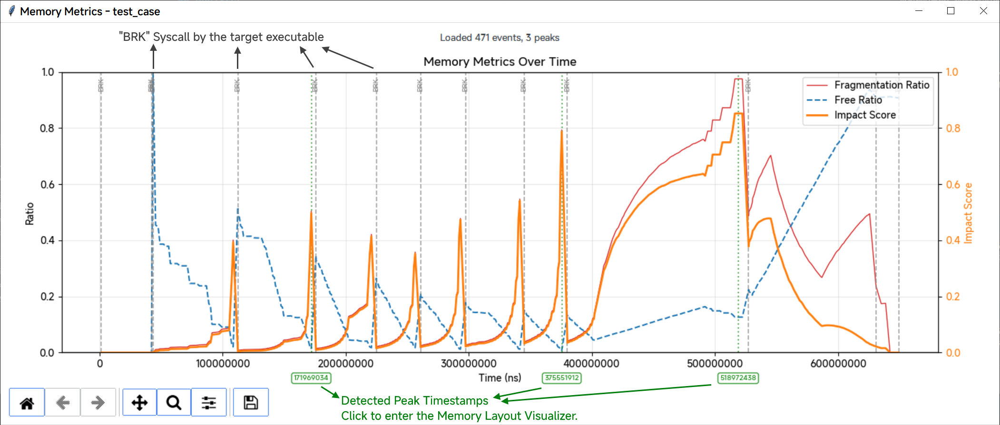

# MemProfiler

Memory tracing tool, used for offline debugging.

## Environment

- Ubuntu 22.04
- CMake 3.22.1
- GCC 12.3.0
- Python >= 3.12

### Clone the Repository

```bash
git clone https://github.com/ibelie/memprofiler.git
cd memprofiler
```

### Install Dependencies

```bash
sudo apt update
sudo apt install -y cmake build-essential libdw-dev libelf-dev libzstd-dev libunwind-dev libboost-all-dev python3-pip
```

## Get Started

Setup environment

```bash
bash ./setup_env.sh
```

Run example `test_case`

```bash
bash ./run.sh
```

Click the Green outlined timestamps to see the corresponding memory layout.

Note: If the memory layout doesn't show up, please check if the cursor is in the "Pan" mode. Only normal cursor can click the timestamps.



## Tracer

For detailed usage, please refer to [Tracer/README.md](Tracer/README.md)

### Build Tracer

```bash
cd ./Tracer/
bash ./script/build.sh
```

### Trace

```bash
cd build/
./src/mprofiler --category /name --no-print-save --no-print-stack ./test/test_case 
```

Output tracedata will be in `Tracer/build/tracedata/test_case/`

## Analyzer

For detailed usage, please refer to [Analyzer/README.md](Analyzer/README.md)

### Install uv

```bash
python -m pip install uv
```

### Install Python Dependencies

```bash
cd ../../Analyzer/
uv sync
```

### Run Analyzer

```bash
bash script/run_analyzer.sh
```

### Run Visualizer

```bash
uv run visualizer/metrics_plotter.py --base-dir ../Tracer/build/ --benchmark-name test_case
```

## License

This project is licensed under the BSD 2-Clause License - see the [LICENSE](LICENSE) file for details.

## Copyright

Copyright (c) 2026, Chen Jie, Joungtao, Xuzheng Jiang. All rights reserved.
